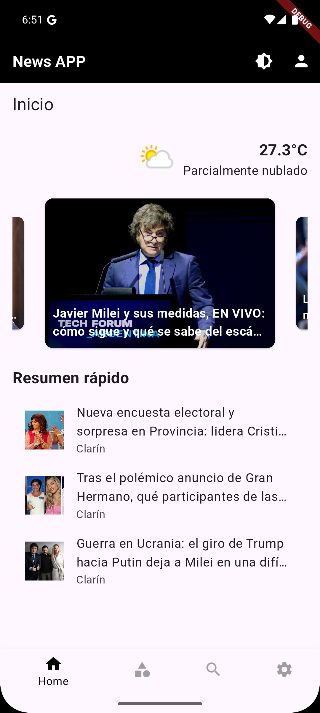
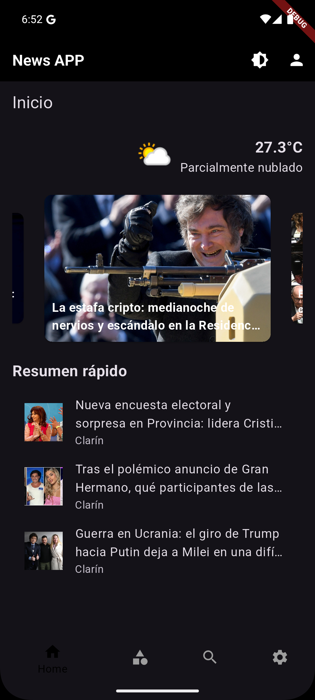
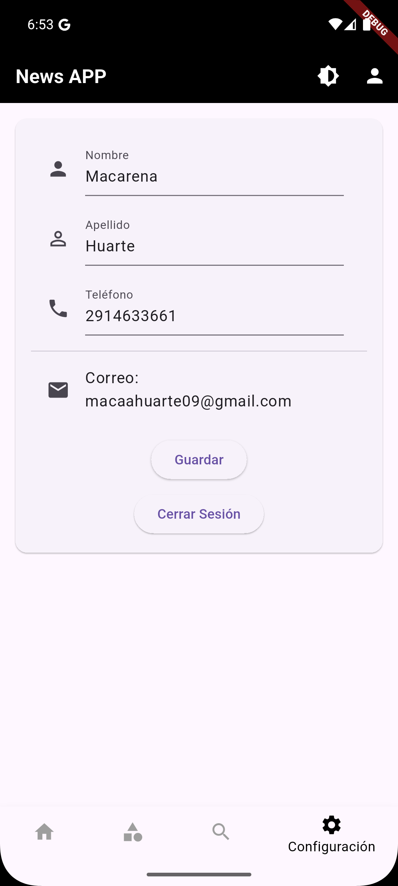
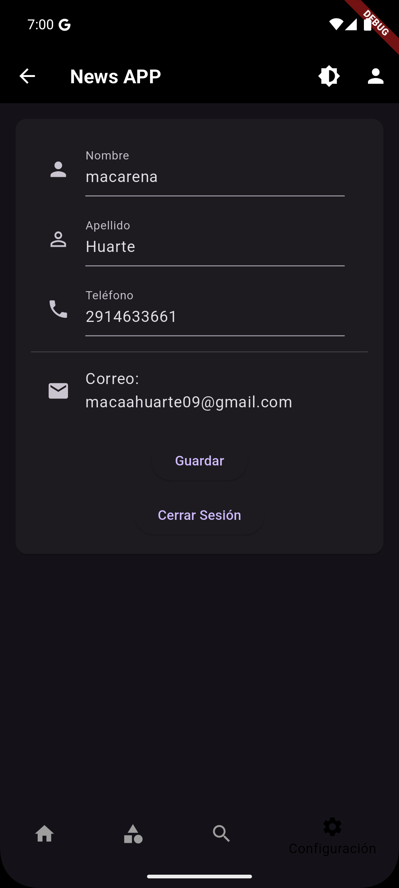
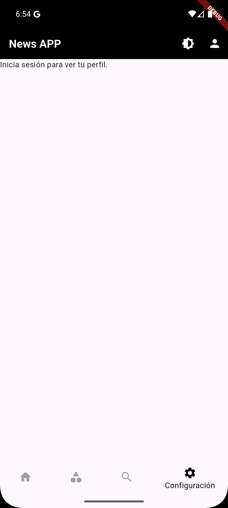
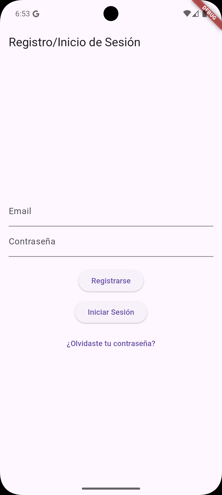
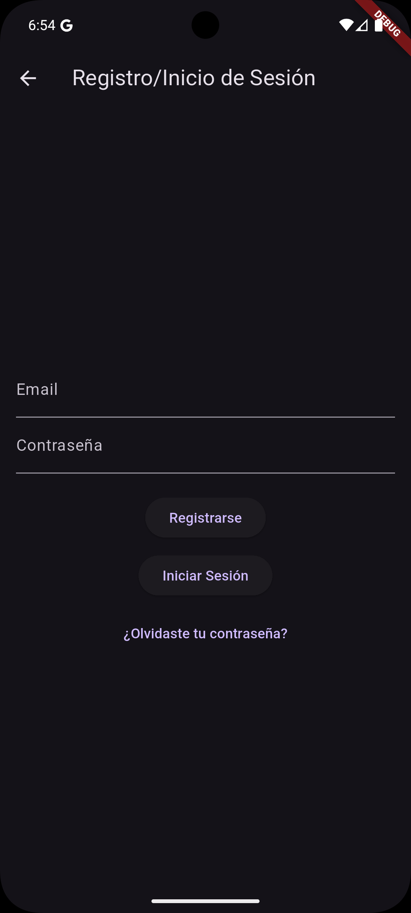

# ARG Noticias - Simulador de Noticias App

Creamos una aplicacion que trae las noticias de Argentina y el mundo a traves de una API. Usa fundamentos de Flutter y usa widgets.

## Integrantes
- Macarena Huarte
- Sofia Gonzalez

## Tabla de Contenidos

- [Descripción](#descripción)
- [Instalación](#instalación)
- [Funcionamiento](#funcionamiento)
- [Contenido](#contenido)
- [Pantallas](#pantallas)
- [Uso](#uso)

  
## Descripción
Creamos una aplicacion que trae las noticias de Argentina y el mundo a traves de una API. Usa fundamentos de Flutter y usa widgets.

## Instalación
Pasos para instalar y configurar tu proyecto localmente.

1. **Clonar el repositorio:**

    ```bash
    git clone (https://github.com/tomasmerlo1/Prototipo-Flutter.git)
    ```

2. **Instalar dependencias:**

    ```bash
    cd Prototipo-Flutter
    flutter pub get
    ```

3. **Configurar variables de entorno:**

    Copia el archivo `.env` a tu  `.env` y edítalo según sea su ip.
   Que lo busca en CMD y pone ipconfig y va hasta la linea  Dirección IPv4 y copia su ip y lo coloca en lugar del mio
   
## Uso
El proyecto fue realizado y probado en una virtualización del Pixel 8 Android 15.0("VanillaIceCream") | x86_64

## Funcionamiento
Desde la pantalla principal se puede apreciar un menu touch en la parte de abajo, donde si apretas una de esos iconos , veras la parte de noticias, buscador y perfil. en la parte sueperior derecha vas a encontrar el modo noche o dia y para iniciar sesion 

## Contenido
- Models:
  * `noticias_model.dart`

- Providers:
  * `news_provider.dart`
  * `theme_provider.dart`

- Screens:
  * `home_screen.dart`
  * `login_screen.dart`
  * `main_screen.dart`
  * `noticias_detalle_api_screen.dart`
  * `Noticias_screen.dart`
  * `search_screen.dart`
  * `settings_screen.dart`

- Services:
  * `news_api.dart`
  * `shared_prefs_service.dart`
  * `weather_api.dart`

- Widgets:
  * `noticias_card.dart`

## Pantallas
- Home



- Noticias


- Configuraciones/Perfil




- Registarse / Inicio Sesion

 


